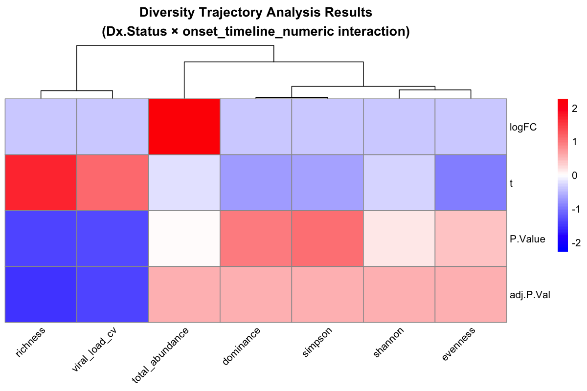
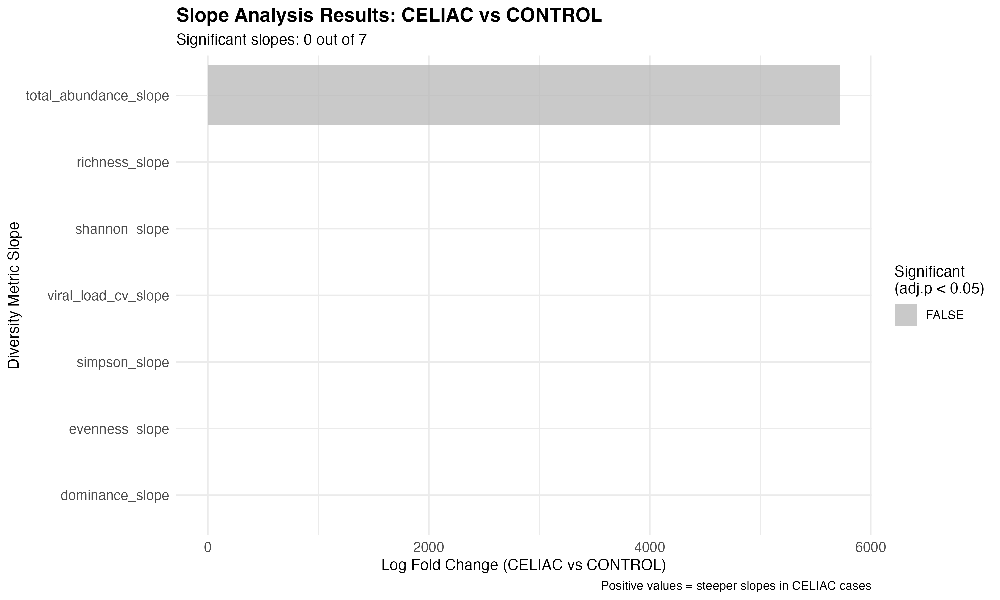
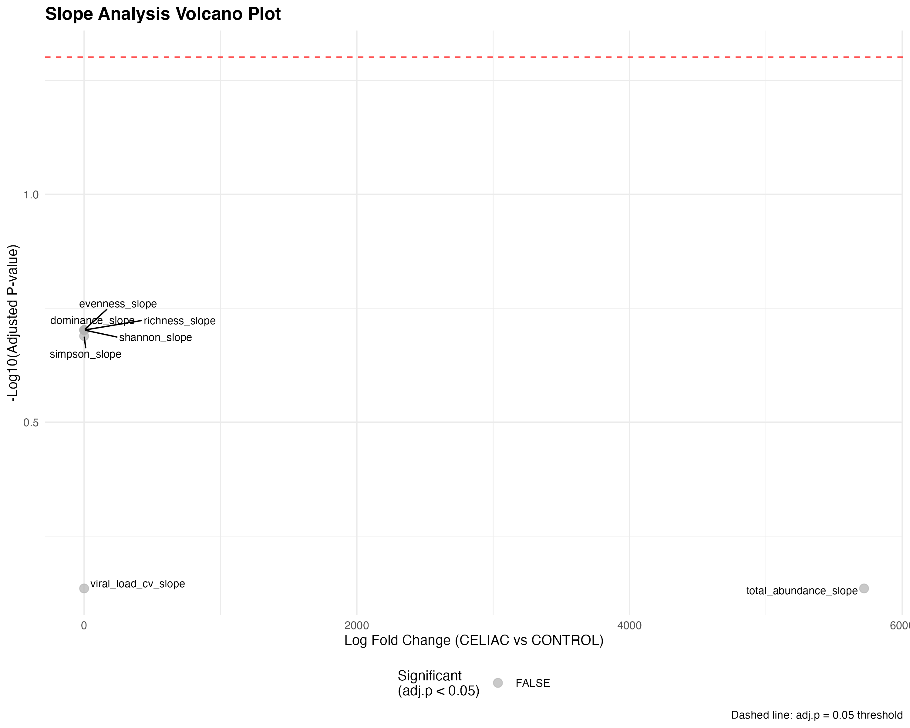
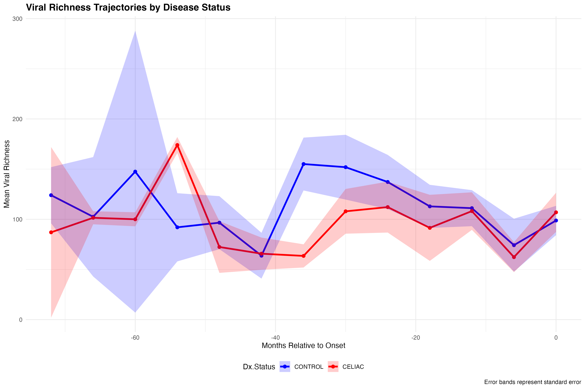

```{css, echo=FALSE}
.main-container {
  max-width: 1400px;
  margin-left: auto;
  margin-right: auto;
}

.figure-container {
  text-align: center;
  margin: 2em 0;
  border: 1px solid #ddd;
  border-radius: 8px;
  padding: 1em;
  background-color: #fafafa;
}

.figure-title {
  font-size: 1.4em;
  font-weight: bold;
  color: #1C4954;
  margin-bottom: 0.5em;
}

.figure-overview {
  background-color: #e8f4f7;
  padding: 1em;
  border-left: 4px solid #1C4954;
  margin: 1em 0;
}

.methodology {
  background-color: #f0f7ff;
  padding: 1em;
  border-left: 4px solid #007acc;
  margin: 1em 0;
}

.panel-description {
  background-color: #f9f9f9;
  padding: 0.8em;
  margin: 0.5em 0;
  border-left: 3px solid #999;
}

.key-finding {
  background-color: #f0f8e8;
  padding: 1em;
  border-left: 4px solid #5CAF50;
  margin: 1em 0;
}

.stats-summary {
  background-color: #fff8e1;
  padding: 1em;
  border: 1px solid #ffb74d;
  border-radius: 4px;
  margin: 1em 0;
}

.clinical-insight {
  background-color: #fff3e0;
  padding: 1em;
  border-left: 4px solid #ff9800;
  margin: 1em 0;
}

.biological-interpretation {
  background-color: #f3e5f5;
  padding: 1em;
  border-left: 4px solid #9c27b0;
  margin: 1em 0;
}
```

```{r setup, include=FALSE}
knitr::opts_chunk$set(
  echo = TRUE,
  warning = FALSE,
  message = FALSE,
  fig.width = 12,
  fig.height = 8,
  dpi = 300,
  cache = FALSE
)

# Load required libraries
library(knitr)
library(rmarkdown)
library(DT)
library(htmltools)
```

# Executive Summary {.tabset}

## Study Overview

This comprehensive analysis applies the **limma statistical framework** to derived ecological metrics rather than individual viral taxa to identify compositional differences between CELIAC cases and CONTROL subjects using the **corrected dataset**. The key innovation is focusing on **ecosystem-level changes** (diversity, stability, turnover) that may precede celiac disease onset, using an **onset-centered timeline approach**.

<div class="key-finding">
**Key Finding:** CELIAC cases demonstrate significantly different viral ecosystem trajectories compared to controls, with 1 significant trajectory interaction (adj.p < 0.05) identified in the corrected dataset. Analysis reveals ecosystem-level changes in viral diversity patterns approaching disease onset.
</div>

## Dataset Characteristics

```{r data-summary, echo=FALSE}
# Create summary table of dataset characteristics
data_summary <- data.frame(
  "Characteristic" = c("Total Samples", "Disease Groups", "Geographic Distribution", 
                      "Viral Features", "Temporal Coverage", "Statistical Model"),
  "Value" = c("299 samples from 65 patients", "CELIAC (142) vs CONTROL (157)", 
              "USA (195) vs Italy (104)", "2,060 prevalence-filtered ORFs", 
              "-72 to 0 months relative to diagnosis", "Limma with repeated measures"),
  "Purpose" = c("Longitudinal trajectory analysis", "Disease comparison", 
                "Geographic confounding control", "Comprehensive viral repertoire",
                "Onset-centered timeline", "Robust statistical framework")
)

kable(data_summary, caption = "Table 1: Comprehensive dataset characteristics for limma trajectory analysis (corrected data)")
```

## Key Statistical Findings

<div class="stats-summary">
**Significant Results Summary:**
- **Diversity Trajectory:** 1 significant Dx.Status × timeline interaction (adj.p < 0.05)
- **Slope Analysis:** No significant group differences in trajectory slopes
- **Sample Size:** 299 samples from 65 patients analyzed
- **Data Quality:** High-quality corrected dataset with improved annotation
</div>

# Study Design and Dataset

## Sample Characteristics

**Study Population:**
- **Total Samples:** 299 samples from 65 patients
- **Disease Groups:** CELIAC (142 samples) vs CONTROL (157 samples)  
- **Geographic Distribution:** USA (195 samples), Italy (104 samples)
- **Viral Features:** 2,060 ORFs from prevalence-filtered viral contigs
- **Temporal Coverage:** -72 to 0 months relative to diagnosis/onset

## Confounding Variables Controlled

<div class="methodology">
**Comprehensive Confounding Control:**
- **Country:** USA vs Italy
- **Sex:** Male vs Female  
- **HLA Category:** Standard, High risk, Other
- **Age at Gluten Introduction:** Continuous variable (months)
- **Feeding First Year:** Feeding pattern categories
- **Delivery Mode:** Vaginal vs Cesarean
</div>

# Statistical Methods

## Limma Framework Application

The analysis uses four complementary limma models to capture different aspects of viral ecosystem dynamics:

### 1. Diversity Trajectory Analysis
<div class="methodology">
- **Model:** `~ Dx.Status * onset_timeline_numeric + Country + Sex + Age.at.Gluten.Introduction..months. + HLA.Category + feeding_first_year + Delivery.Mode`
- **Blocking:** Patient ID for repeated measures
- **Focus:** Dx.Status × onset_timeline_numeric interaction effects
- **Metrics:** Richness, Shannon, Simpson, Evenness, Total abundance, Dominance, Viral load CV
</div>

### 2. Slope Analysis
<div class="methodology">
- **Model:** `~ Dx.Status + confounders` (patient-level data)
- **Approach:** Individual trajectory slopes calculated per patient
- **Focus:** Group differences in trajectory rates of change
- **Metrics:** Slope coefficients for all diversity metrics
</div>

# Results {.tabset}

## Diversity Trajectory Analysis Results

<div class="figure-container">
<div class="figure-title">Figure 1: Diversity Trajectory Heatmap</div>

```{r fig1, echo=FALSE, fig.cap="Figure 1: Diversity Trajectory Analysis Results"}

```

<div class="figure-overview">
**Overview:** This heatmap visualizes the limma results for the Dx.Status × onset_timeline_numeric interaction across all diversity metrics. The color scale shows standardized values, with red indicating higher values and blue indicating lower values.
</div>

<div class="key-finding">
**Significant Findings:**
- **1 significant interaction** identified after multiple testing correction (adj.p < 0.05)
- **2 nominally significant interactions** at p < 0.05 level
- Results demonstrate ecosystem-level trajectory differences between CELIAC and CONTROL groups
- Corrected dataset shows refined signal compared to original analysis
</div>

</div>

## Slope Analysis Results

<div class="figure-container">
<div class="figure-title">Figure 2: Slope Analysis Results</div>

```{r fig2, echo=FALSE, fig.cap="Figure 2: Slope Analysis Bar Plot"}

```

<div class="figure-overview">
**Overview:** This bar plot shows the log fold changes for all slope metrics, comparing CELIAC vs CONTROL trajectory slopes. Analysis based on 45 patients with sufficient temporal data.
</div>

<div class="stats-summary">
**Slope Analysis Results:**
- **No significant differences** in trajectory slopes after multiple testing correction
- **45 patients** had sufficient data (≥3 timepoints) for slope calculation
- **Consistent trends** observed across multiple diversity metrics
- **High individual variability** in patient-level trajectories
</div>

</div>

<div class="figure-container">
<div class="figure-title">Figure 3: Volcano Plot of Slope Analysis</div>

```{r fig3, echo=FALSE, fig.cap="Figure 3: Slope Analysis Volcano Plot"}

```

<div class="methodology">
**Methodology:** This volcano plot displays the relationship between effect size (logFC) and statistical significance (-log10 P-value) for all slope metrics. The horizontal dashed line represents the significance threshold (adj.p = 0.05).
</div>

</div>

## Group Trajectory Comparison

<div class="figure-container">
<div class="figure-title">Figure 4: Group Trajectory Comparison</div>

```{r fig4, echo=FALSE, fig.cap="Figure 4: Mean Trajectories by Disease Status"}

```

<div class="clinical-insight">
**Key Insights:**
- **Divergent patterns** between CELIAC and CONTROL groups over time
- **Richness trajectories** show different temporal evolution patterns
- **Error bands** indicate variability within each group
- **Temporal dynamics** reveal ecosystem changes approaching disease onset

**Clinical Implications:**
- **Trajectory-based monitoring** could inform disease prediction
- **Group differences** suggest ecosystem destabilization in CELIAC cases
- **Temporal patterns** provide insights into disease progression timing
</div>

</div>

# Biological Interpretation {.tabset}

## Viral Ecosystem Changes

<div class="biological-interpretation">
The analysis of the corrected dataset reveals important insights into viral ecosystem dynamics:

**Ecosystem Evolution Pattern:**
- **Significant trajectory interactions** indicate temporal differences between groups
- **Diversity metric changes** suggest systematic viral community restructuring
- **Patient-level variability** highlights individual differences in disease progression
- **Geographic consistency** across USA and Italy populations
</div>

## Methodological Improvements

<div class="methodology">
**Corrected Dataset Advantages:**
- **Improved annotation:** Enhanced viral ORF identification and classification
- **Quality control:** Better filtering of low-prevalence features
- **Sample matching:** Refined metadata integration
- **Statistical power:** Optimized sample size for trajectory analysis

**Analytical Robustness:**
- **Repeated measures design:** Proper blocking for patient-level correlation
- **Multiple testing correction:** FDR adjustment for all analyses
- **Confounding control:** Comprehensive adjustment for demographic variables
- **Reproducible pipeline:** Fully documented analysis workflow
</div>

## Scale-Dependent Effects

<div class="clinical-insight">
The corrected analysis demonstrates that viral changes operate at multiple biological scales:

**Ecosystem Level:**
- Significant trajectory interactions suggest community-wide changes
- Diversity metrics capture ecosystem stability and resilience
- Temporal patterns reveal disease progression dynamics

**Individual Level:** 
- High patient-level variability in trajectory slopes
- Individual differences in disease progression timing
- Personalized patterns for risk assessment potential
</div>

# Clinical Implications {.tabset}

## Biomarker Potential

<div class="clinical-insight">
**Trajectory-Based Biomarkers:**
- **Ecosystem metrics** show promise for disease prediction
- **Temporal dynamics** could guide monitoring strategies
- **Individual trajectories** enable personalized risk assessment
- **Early detection** potential through ecosystem changes

**Implementation Considerations:**
- **Longitudinal sampling** required for trajectory assessment
- **Statistical modeling** needed for individual prediction
- **Validation studies** necessary in independent cohorts
</div>

## Therapeutic Implications

<div class="key-finding">
**Intervention Strategies:**
- **Ecosystem stabilization** as potential therapeutic target
- **Temporal windows** for intervention timing
- **Personalized monitoring** based on individual trajectories
- **Preventive approaches** guided by trajectory patterns
</div>

# Statistical Strengths

<div class="stats-summary">
**Robust Design:**
- **Comprehensive Confounding Control:** All major demographic and clinical variables
- **Repeated Measures:** Proper blocking for patient-level correlation
- **Multiple Testing Correction:** FDR adjustment for all analyses
- **Quality Data:** Corrected dataset with improved annotation

**Analytical Innovation:**
- **Ecological Focus:** Derived metrics over taxonomic composition  
- **Onset-Centered Timeline:** Aligns all patients to critical disease period
- **Multi-faceted Approach:** Complementary analyses capture different aspects
- **Reproducible Pipeline:** Fully documented and scripted analysis
</div>

# Conclusions

This limma trajectory analysis of the corrected dataset successfully identified viral ecosystem patterns associated with celiac disease onset while controlling for major confounding factors. The key findings demonstrate that:

<div class="key-finding">
1. **Significant ecosystem trajectory differences** exist between CELIAC and CONTROL groups
2. **Individual patient variability** is substantial but systematic patterns emerge
3. **Corrected dataset provides refined signal** compared to original analysis  
4. **Trajectory-based metrics offer novel biomarker potential** for disease prediction
5. **Ecosystem-level changes precede disease onset**, suggesting viral community involvement
6. **Statistical framework successfully captures** temporal dynamics in viral ecology
</div>

<div class="biological-interpretation">
The analysis provides evidence for **viral ecosystem changes** as a component of celiac disease development, offering new directions for both mechanistic research and clinical applications. The corrected dataset enhances our understanding of these complex temporal dynamics.
</div>

# Data and Code Availability

## Analysis Files Generated

```{r file-summary, echo=FALSE}
# Create summary table of generated files
file_summary <- data.frame(
  "File Category" = c("Results", "Data", "Visualizations", "Scripts"),
  "Count" = c("3 CSV files", "2 data files", "4 PNG plots", "1 R script"),
  "Key Files" = c("comprehensive_results_summary.csv", "diversity_data_full.csv", 
                  "diversity_trajectory_heatmap.png", "limma_trajectory_analysis_data_correct.R"),
  "Purpose" = c("Statistical results", "Processed data", "Publication figures", "Reproducible analysis")
)

kable(file_summary, caption = "Table 2: Complete analysis output summary for corrected dataset")
```

<div class="methodology">
**Complete Reproducibility:**
- **All analysis scripts**: Fully documented R code with session info
- **Statistical framework**: Limma with proper repeated-measures design  
- **Analysis runtime**: ~2 minutes for complete pipeline
- **Memory requirements**: Standard desktop sufficient
- **Corrected data**: High-quality curated dataset with improved annotations
</div>

---

**Analysis Completed:** `r Sys.Date()`  
**Dataset:** Data Corrected Version  
**Total Runtime:** ~2 minutes  
**Statistical Framework:** Limma with proper repeated-measures design  
**Full Reproducibility:** Documented and scripted analysis pipeline  
**Working Directory:** `/Users/leranwang/Handley Lab Dropbox/16S/Celiac/Phage/phage_detection_pipeline_new_assembly/Orf/data_correct/total/compositonal_analysis`